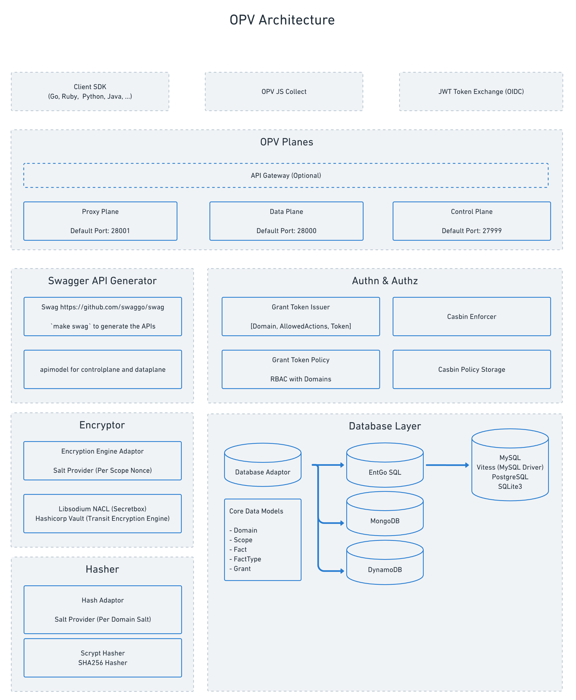

# Open Privacy Vault

## 1. Introduction

### 1.1 Get Started

Start from source code:

```sh
git clone https://github.com/open-privacy/opv
cd opv
make deps
make vendor
make run
```

Start from docker image (TODO):

```sh
docker run -it -p 27999-28001:27999-28001 open-privacy/opv
```

### 1.2 Configuration

All the configuration is currently done via the environment variables.

## 2. Architecture



### 2.1 Planes

#### 2.1.1 Control Plane

Control plane (`default port: 27999`) is a group of controllers that handle the admin related logic.

Control plane currently manages

- `Grant`
- `Grant Token`
- `Grant Permissions`

#### 2.1.2 Data Plane

Data plane (`default port: 28000`) is a group of controllers that handle the crud logic related to
PII information.

Data plane currently manages

- `Scope`
- `Fact`
- `Fact Types`

#### 2.1.3 Proxy Plane (TODO)

Proxy plane will handle multiple protocols' (HTTP/SMTP/) requests and responses rewrite on-the-fly with PII tokenization rules.

### 2.2 Encryption

OPV's encryption is designed to work with multiple encryption engine. Currently supported encryption engines are

- Libsodium
  - Secretbox
- Hashicorp Vault (TODO)
  - Transit Secret

### 2.3 Hash

OPV's hash function is designed to generate consistent hash so that we can enable optional search without storing or accessing the plaintext of PII information. Currently supported hash algorithms are

- Scrypt
- SHA256 (TODO)

### 2.4 Authn & Authz

OPV uses Key-Auth (HTTP Header `X-OPV-GRANT-TOKEN`) for authentication.

OPV uses [casbin](https://github.com/casbin/casbin) for authorization. We leverage the RBAC with multi domain model to have fine-grained access control of the `Grant Token`. See RBAC model definition [here](https://github.com/open-privacy/opv/blob/main/pkg/authz/casbin.go).

### 2.5 Database Adapter

OPV uses an entity framework [ent](https://github.com/ent/ent) to manages the core data model.

```sh
# Once ./pkg/ent/schema/ changed, regenerate the ent model with auto migration
make ent
```

## 3. Development

Make sure you have `go` and `make` installed.

```sh
# Prepare dependencies and compile opv
make deps
make vendor
make run
```

One can open the local swagger UI to test the APIs:

- Default DataPlane Swagger URL: http://127.0.0.1:28000/swagger/index.html
- Default ControlPlane Swagger URL: http://127.0.0.1:27999/swagger/index.html
