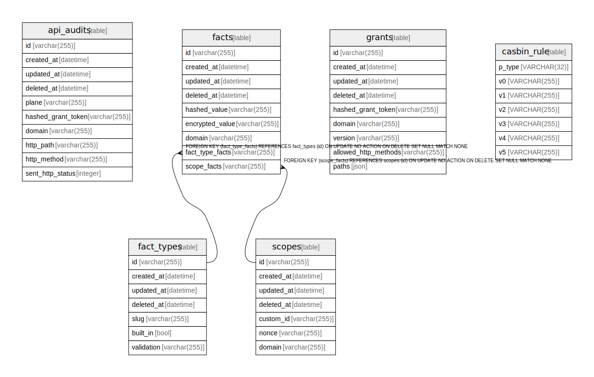

# _opv.sqlite

## Tables

| Name                          | Columns | Comment | Type  |
| ----------------------------- | ------- | ------- | ----- |
| [api_audits](api_audits.md)   | 10      |         | table |
| [facts](facts.md)             | 9       |         | table |
| [fact_types](fact_types.md)   | 7       |         | table |
| [grants](grants.md)           | 9       |         | table |
| [scopes](scopes.md)           | 7       |         | table |
| [casbin_rule](casbin_rule.md) | 7       |         | table |

## Relations

---

> Generated by [tbls](https://github.com/k1LoW/tbls)
