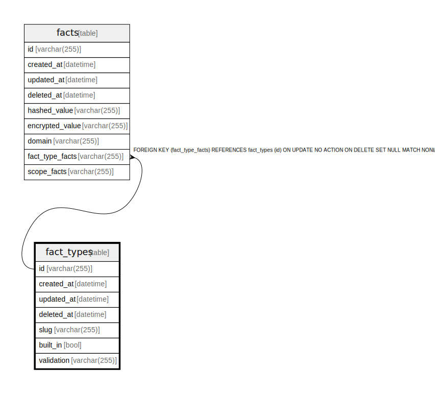

# fact_types

## Description

<details>
<summary><strong>Table Definition</strong></summary>

```sql
CREATE TABLE `fact_types`(`id` varchar(255) NOT NULL, `created_at` datetime NOT NULL, `updated_at` datetime NOT NULL, `deleted_at` datetime NULL, `slug` varchar(255) NOT NULL, `built_in` bool NOT NULL, `validation` varchar(255) NULL, PRIMARY KEY(`id`))
```

</details>

## Columns

| Name       | Type         | Default | Nullable | Children          | Parents | Comment |
| ---------- | ------------ | ------- | -------- | ----------------- | ------- | ------- |
| id         | varchar(255) |         | false    | [facts](facts.md) |         |         |
| created_at | datetime     |         | false    |                   |         |         |
| updated_at | datetime     |         | false    |                   |         |         |
| deleted_at | datetime     |         | true     |                   |         |         |
| slug       | varchar(255) |         | false    |                   |         |         |
| built_in   | bool         |         | false    |                   |         |         |
| validation | varchar(255) |         | true     |                   |         |         |

## Constraints

| Name                          | Type        | Definition       |
| ----------------------------- | ----------- | ---------------- |
| id                            | PRIMARY KEY | PRIMARY KEY (id) |
| sqlite_autoindex_fact_types_1 | PRIMARY KEY | PRIMARY KEY (id) |

## Indexes

| Name                          | Definition                                                       |
| ----------------------------- | ---------------------------------------------------------------- |
| facttype_deleted_at           | CREATE INDEX `facttype_deleted_at` ON `fact_types`(`deleted_at`) |
| facttype_updated_at           | CREATE INDEX `facttype_updated_at` ON `fact_types`(`updated_at`) |
| facttype_created_at           | CREATE INDEX `facttype_created_at` ON `fact_types`(`created_at`) |
| facttype_id                   | CREATE UNIQUE INDEX `facttype_id` ON `fact_types`(`id`)          |
| sqlite_autoindex_fact_types_1 | PRIMARY KEY (id)                                                 |

## Relations



---

> Generated by [tbls](https://github.com/k1LoW/tbls)
