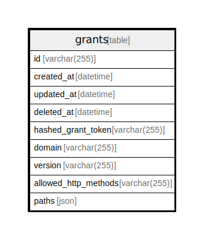

# grants

## Description

<details>
<summary><strong>Table Definition</strong></summary>

```sql
CREATE TABLE `grants`(`id` varchar(255) NOT NULL, `created_at` datetime NOT NULL, `updated_at` datetime NOT NULL, `deleted_at` datetime NULL, `hashed_grant_token` varchar(255) NOT NULL, `domain` varchar(255) NOT NULL, `version` varchar(255) NOT NULL, `allowed_http_methods` varchar(255) NOT NULL, `paths` json NOT NULL, PRIMARY KEY(`id`))
```

</details>

## Columns

| Name                 | Type         | Default | Nullable | Children | Parents | Comment |
| -------------------- | ------------ | ------- | -------- | -------- | ------- | ------- |
| id                   | varchar(255) |         | false    |          |         |         |
| created_at           | datetime     |         | false    |          |         |         |
| updated_at           | datetime     |         | false    |          |         |         |
| deleted_at           | datetime     |         | true     |          |         |         |
| hashed_grant_token   | varchar(255) |         | false    |          |         |         |
| domain               | varchar(255) |         | false    |          |         |         |
| version              | varchar(255) |         | false    |          |         |         |
| allowed_http_methods | varchar(255) |         | false    |          |         |         |
| paths                | json         |         | false    |          |         |         |

## Constraints

| Name                      | Type        | Definition       |
| ------------------------- | ----------- | ---------------- |
| id                        | PRIMARY KEY | PRIMARY KEY (id) |
| sqlite_autoindex_grants_1 | PRIMARY KEY | PRIMARY KEY (id) |

## Indexes

| Name                      | Definition                                                                |
| ------------------------- | ------------------------------------------------------------------------- |
| grant_domain              | CREATE INDEX `grant_domain` ON `grants`(`domain`)                         |
| grant_hashed_grant_token  | CREATE INDEX `grant_hashed_grant_token` ON `grants`(`hashed_grant_token`) |
| grant_deleted_at          | CREATE INDEX `grant_deleted_at` ON `grants`(`deleted_at`)                 |
| grant_updated_at          | CREATE INDEX `grant_updated_at` ON `grants`(`updated_at`)                 |
| grant_created_at          | CREATE INDEX `grant_created_at` ON `grants`(`created_at`)                 |
| grant_id                  | CREATE UNIQUE INDEX `grant_id` ON `grants`(`id`)                          |
| sqlite_autoindex_grants_1 | PRIMARY KEY (id)                                                          |

## Relations



---

> Generated by [tbls](https://github.com/k1LoW/tbls)
