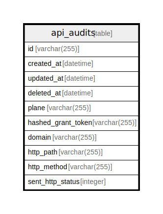

# api_audits

## Description

<details>
<summary><strong>Table Definition</strong></summary>

```sql
CREATE TABLE `api_audits`(`id` varchar(255) NOT NULL, `created_at` datetime NOT NULL, `updated_at` datetime NOT NULL, `deleted_at` datetime NULL, `plane` varchar(255) NOT NULL, `hashed_grant_token` varchar(255) NULL, `domain` varchar(255) NULL, `http_path` varchar(255) NULL, `http_method` varchar(255) NULL, `sent_http_status` integer NULL, PRIMARY KEY(`id`))
```

</details>

## Columns

| Name               | Type         | Default | Nullable | Children | Parents | Comment |
| ------------------ | ------------ | ------- | -------- | -------- | ------- | ------- |
| id                 | varchar(255) |         | false    |          |         |         |
| created_at         | datetime     |         | false    |          |         |         |
| updated_at         | datetime     |         | false    |          |         |         |
| deleted_at         | datetime     |         | true     |          |         |         |
| plane              | varchar(255) |         | false    |          |         |         |
| hashed_grant_token | varchar(255) |         | true     |          |         |         |
| domain             | varchar(255) |         | true     |          |         |         |
| http_path          | varchar(255) |         | true     |          |         |         |
| http_method        | varchar(255) |         | true     |          |         |         |
| sent_http_status   | integer      |         | true     |          |         |         |

## Constraints

| Name                          | Type        | Definition       |
| ----------------------------- | ----------- | ---------------- |
| id                            | PRIMARY KEY | PRIMARY KEY (id) |
| sqlite_autoindex_api_audits_1 | PRIMARY KEY | PRIMARY KEY (id) |

## Indexes

| Name                          | Definition                                                                       |
| ----------------------------- | -------------------------------------------------------------------------------- |
| apiaudit_sent_http_status     | CREATE INDEX `apiaudit_sent_http_status` ON `api_audits`(`sent_http_status`)     |
| apiaudit_http_method          | CREATE INDEX `apiaudit_http_method` ON `api_audits`(`http_method`)               |
| apiaudit_http_path            | CREATE INDEX `apiaudit_http_path` ON `api_audits`(`http_path`)                   |
| apiaudit_domain               | CREATE INDEX `apiaudit_domain` ON `api_audits`(`domain`)                         |
| apiaudit_hashed_grant_token   | CREATE INDEX `apiaudit_hashed_grant_token` ON `api_audits`(`hashed_grant_token`) |
| apiaudit_plane                | CREATE INDEX `apiaudit_plane` ON `api_audits`(`plane`)                           |
| apiaudit_deleted_at           | CREATE INDEX `apiaudit_deleted_at` ON `api_audits`(`deleted_at`)                 |
| apiaudit_updated_at           | CREATE INDEX `apiaudit_updated_at` ON `api_audits`(`updated_at`)                 |
| apiaudit_created_at           | CREATE INDEX `apiaudit_created_at` ON `api_audits`(`created_at`)                 |
| apiaudit_id                   | CREATE UNIQUE INDEX `apiaudit_id` ON `api_audits`(`id`)                          |
| sqlite_autoindex_api_audits_1 | PRIMARY KEY (id)                                                                 |

## Relations



---

> Generated by [tbls](https://github.com/k1LoW/tbls)
