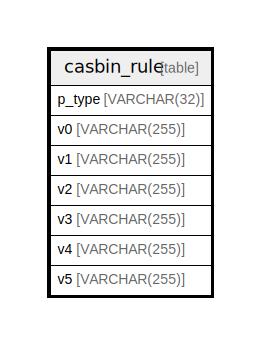

# casbin_rule

## Description

<details>
<summary><strong>Table Definition</strong></summary>

```sql
CREATE TABLE casbin_rule(
    p_type VARCHAR(32)  DEFAULT '' NOT NULL,
    v0     VARCHAR(255) DEFAULT '' NOT NULL,
    v1     VARCHAR(255) DEFAULT '' NOT NULL,
    v2     VARCHAR(255) DEFAULT '' NOT NULL,
    v3     VARCHAR(255) DEFAULT '' NOT NULL,
    v4     VARCHAR(255) DEFAULT '' NOT NULL,
    v5     VARCHAR(255) DEFAULT '' NOT NULL,
    CHECK (TYPEOF("p_type") = "text" AND
           LENGTH("p_type") <= 32),
    CHECK (TYPEOF("v0") = "text" AND
           LENGTH("v0") <= 255),
    CHECK (TYPEOF("v1") = "text" AND
           LENGTH("v1") <= 255),
    CHECK (TYPEOF("v2") = "text" AND
           LENGTH("v2") <= 255),
    CHECK (TYPEOF("v3") = "text" AND
           LENGTH("v3") <= 255),
    CHECK (TYPEOF("v4") = "text" AND
           LENGTH("v4") <= 255),
    CHECK (TYPEOF("v5") = "text" AND
           LENGTH("v5") <= 255)
)
```

</details>

## Columns

| Name   | Type         | Default | Nullable | Children | Parents | Comment |
| ------ | ------------ | ------- | -------- | -------- | ------- | ------- |
| p_type | VARCHAR(32)  | ''      | false    |          |         |         |
| v0     | VARCHAR(255) | ''      | false    |          |         |         |
| v1     | VARCHAR(255) | ''      | false    |          |         |         |
| v2     | VARCHAR(255) | ''      | false    |          |         |         |
| v3     | VARCHAR(255) | ''      | false    |          |         |         |
| v4     | VARCHAR(255) | ''      | false    |          |         |         |
| v5     | VARCHAR(255) | ''      | false    |          |         |         |

## Constraints

| Name | Type  | Definition                                                   |
| ---- | ----- | ------------------------------------------------------------ |
| -    | CHECK | CHECK (TYPEOF("p_type") = "text" AND LENGTH("p_type") <= 32) |
| -    | CHECK | CHECK (TYPEOF("v0") = "text" AND LENGTH("v0") <= 255)        |
| -    | CHECK | CHECK (TYPEOF("v1") = "text" AND LENGTH("v1") <= 255)        |
| -    | CHECK | CHECK (TYPEOF("v2") = "text" AND LENGTH("v2") <= 255)        |
| -    | CHECK | CHECK (TYPEOF("v3") = "text" AND LENGTH("v3") <= 255)        |
| -    | CHECK | CHECK (TYPEOF("v4") = "text" AND LENGTH("v4") <= 255)        |
| -    | CHECK | CHECK (TYPEOF("v5") = "text" AND LENGTH("v5") <= 255)        |

## Indexes

| Name            | Definition                                                   |
| --------------- | ------------------------------------------------------------ |
| idx_casbin_rule | CREATE INDEX idx_casbin_rule ON casbin_rule (p_type, v0, v1) |

## Relations



---

> Generated by [tbls](https://github.com/k1LoW/tbls)
