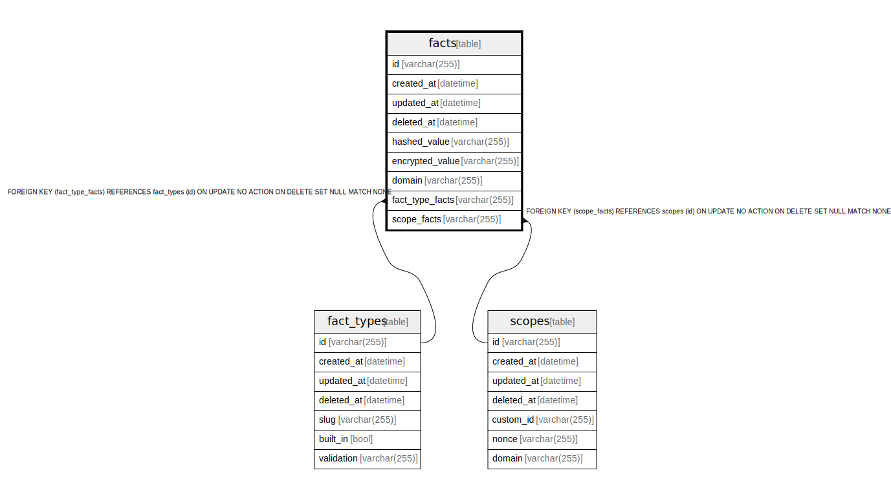

# facts

## Description

<details>
<summary><strong>Table Definition</strong></summary>

```sql
CREATE TABLE `facts`(`id` varchar(255) NOT NULL, `created_at` datetime NOT NULL, `updated_at` datetime NOT NULL, `deleted_at` datetime NULL, `hashed_value` varchar(255) NOT NULL, `encrypted_value` varchar(255) NOT NULL, `domain` varchar(255) NOT NULL, `fact_type_facts` varchar(255) NULL, `scope_facts` varchar(255) NULL, PRIMARY KEY(`id`), FOREIGN KEY(`fact_type_facts`) REFERENCES `fact_types`(`id`) ON DELETE SET NULL, FOREIGN KEY(`scope_facts`) REFERENCES `scopes`(`id`) ON DELETE SET NULL)
```

</details>

## Columns

| Name            | Type         | Default | Nullable | Children | Parents                     | Comment |
| --------------- | ------------ | ------- | -------- | -------- | --------------------------- | ------- |
| id              | varchar(255) |         | false    |          |                             |         |
| created_at      | datetime     |         | false    |          |                             |         |
| updated_at      | datetime     |         | false    |          |                             |         |
| deleted_at      | datetime     |         | true     |          |                             |         |
| hashed_value    | varchar(255) |         | false    |          |                             |         |
| encrypted_value | varchar(255) |         | false    |          |                             |         |
| domain          | varchar(255) |         | false    |          |                             |         |
| fact_type_facts | varchar(255) |         | true     |          | [fact_types](fact_types.md) |         |
| scope_facts     | varchar(255) |         | true     |          | [scopes](scopes.md)         |         |

## Constraints

| Name                     | Type        | Definition                                                                                                 |
| ------------------------ | ----------- | ---------------------------------------------------------------------------------------------------------- |
| id                       | PRIMARY KEY | PRIMARY KEY (id)                                                                                           |
| - (Foreign key ID: 0)    | FOREIGN KEY | FOREIGN KEY (scope_facts) REFERENCES scopes (id) ON UPDATE NO ACTION ON DELETE SET NULL MATCH NONE         |
| - (Foreign key ID: 1)    | FOREIGN KEY | FOREIGN KEY (fact_type_facts) REFERENCES fact_types (id) ON UPDATE NO ACTION ON DELETE SET NULL MATCH NONE |
| sqlite_autoindex_facts_1 | PRIMARY KEY | PRIMARY KEY (id)                                                                                           |

## Indexes

| Name                     | Definition                                                  |
| ------------------------ | ----------------------------------------------------------- |
| fact_domain              | CREATE INDEX `fact_domain` ON `facts`(`domain`)             |
| fact_hashed_value        | CREATE INDEX `fact_hashed_value` ON `facts`(`hashed_value`) |
| fact_deleted_at          | CREATE INDEX `fact_deleted_at` ON `facts`(`deleted_at`)     |
| fact_updated_at          | CREATE INDEX `fact_updated_at` ON `facts`(`updated_at`)     |
| fact_created_at          | CREATE INDEX `fact_created_at` ON `facts`(`created_at`)     |
| fact_id                  | CREATE UNIQUE INDEX `fact_id` ON `facts`(`id`)              |
| sqlite_autoindex_facts_1 | PRIMARY KEY (id)                                            |

## Relations



---

> Generated by [tbls](https://github.com/k1LoW/tbls)
