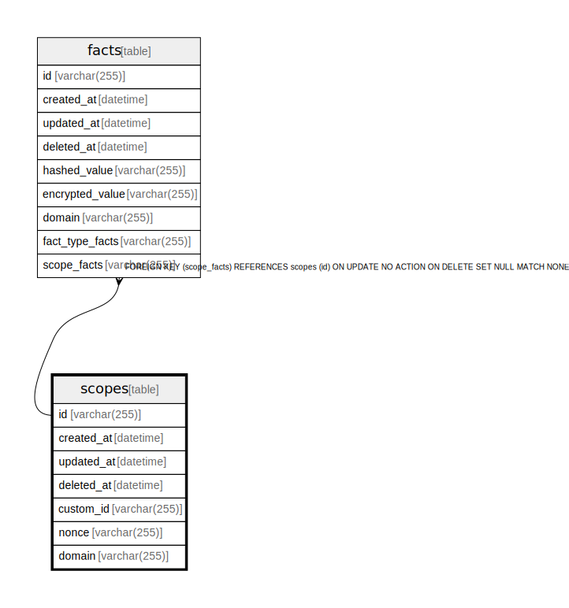

# scopes

## Description

<details>
<summary><strong>Table Definition</strong></summary>

```sql
CREATE TABLE `scopes`(`id` varchar(255) NOT NULL, `created_at` datetime NOT NULL, `updated_at` datetime NOT NULL, `deleted_at` datetime NULL, `custom_id` varchar(255) NOT NULL, `nonce` varchar(255) NOT NULL, `domain` varchar(255) NOT NULL, PRIMARY KEY(`id`))
```

</details>

## Columns

| Name       | Type         | Default | Nullable | Children          | Parents | Comment |
| ---------- | ------------ | ------- | -------- | ----------------- | ------- | ------- |
| id         | varchar(255) |         | false    | [facts](facts.md) |         |         |
| created_at | datetime     |         | false    |                   |         |         |
| updated_at | datetime     |         | false    |                   |         |         |
| deleted_at | datetime     |         | true     |                   |         |         |
| custom_id  | varchar(255) |         | false    |                   |         |         |
| nonce      | varchar(255) |         | false    |                   |         |         |
| domain     | varchar(255) |         | false    |                   |         |         |

## Constraints

| Name                      | Type        | Definition       |
| ------------------------- | ----------- | ---------------- |
| id                        | PRIMARY KEY | PRIMARY KEY (id) |
| sqlite_autoindex_scopes_1 | PRIMARY KEY | PRIMARY KEY (id) |

## Indexes

| Name                      | Definition                                                |
| ------------------------- | --------------------------------------------------------- |
| scope_domain              | CREATE INDEX `scope_domain` ON `scopes`(`domain`)         |
| scope_deleted_at          | CREATE INDEX `scope_deleted_at` ON `scopes`(`deleted_at`) |
| scope_updated_at          | CREATE INDEX `scope_updated_at` ON `scopes`(`updated_at`) |
| scope_created_at          | CREATE INDEX `scope_created_at` ON `scopes`(`created_at`) |
| scope_id                  | CREATE UNIQUE INDEX `scope_id` ON `scopes`(`id`)          |
| sqlite_autoindex_scopes_1 | PRIMARY KEY (id)                                          |

## Relations



---

> Generated by [tbls](https://github.com/k1LoW/tbls)
